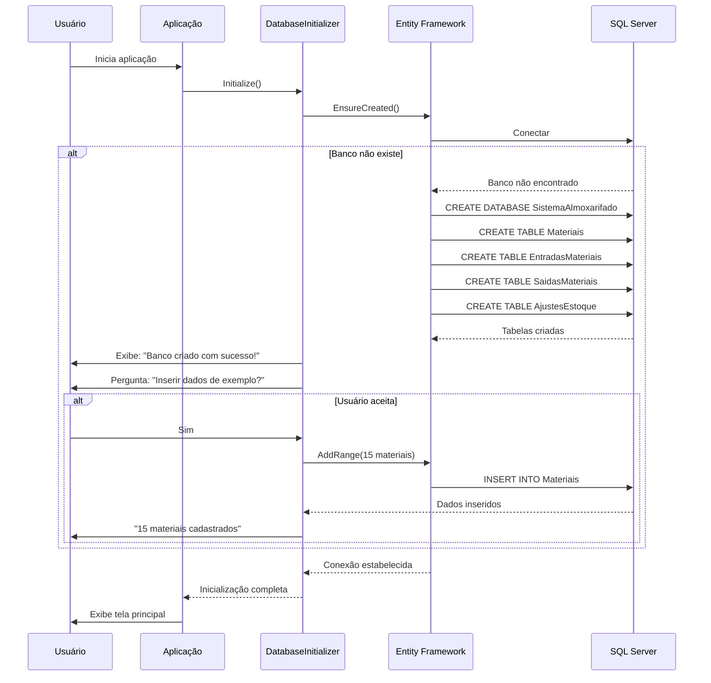
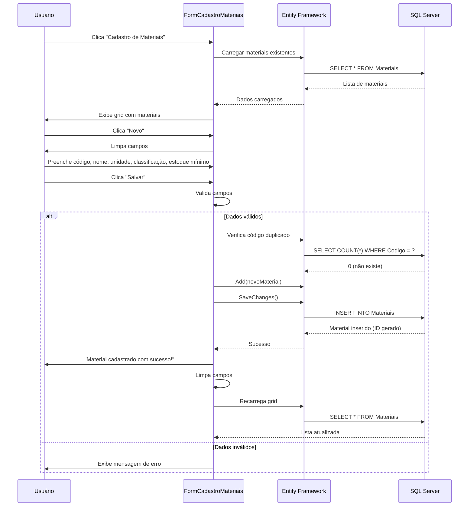
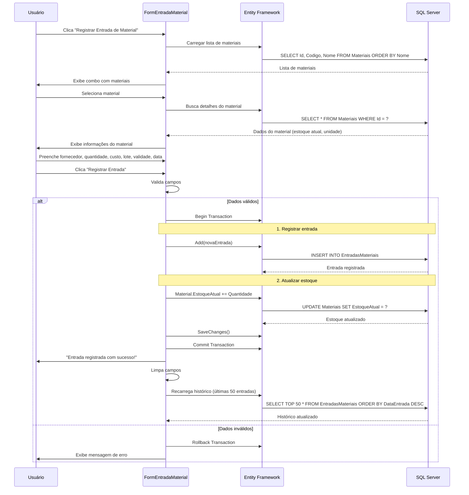
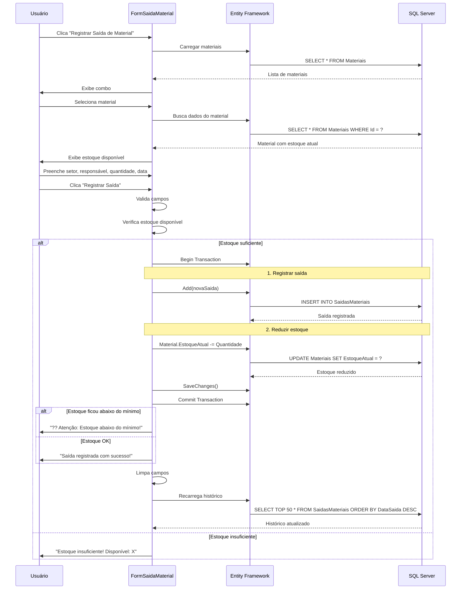
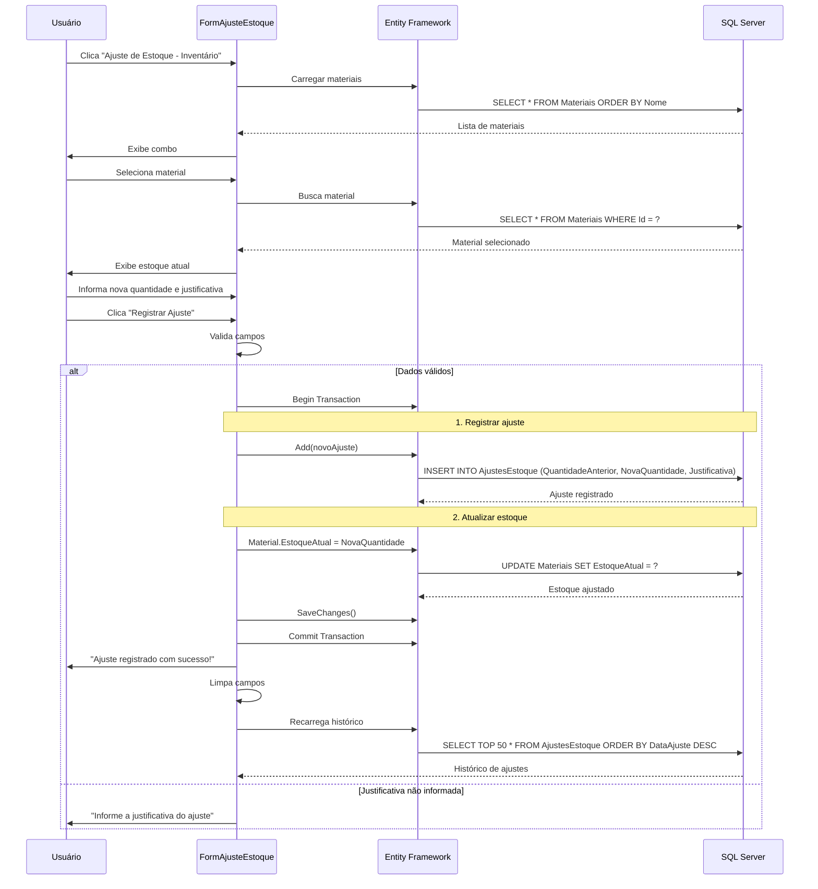
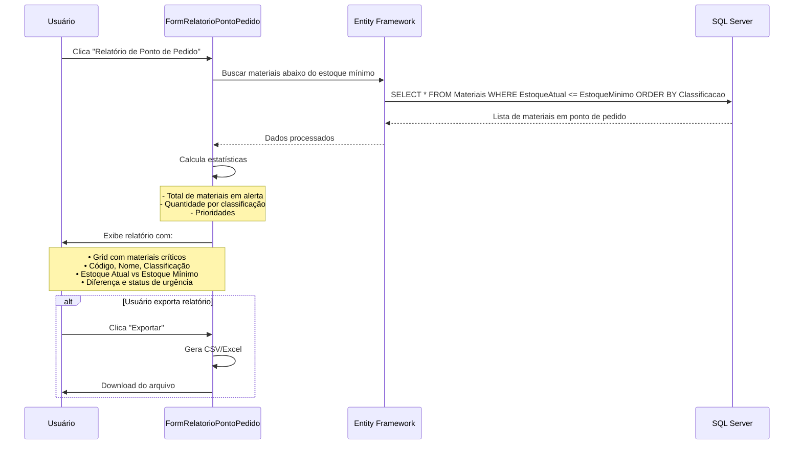
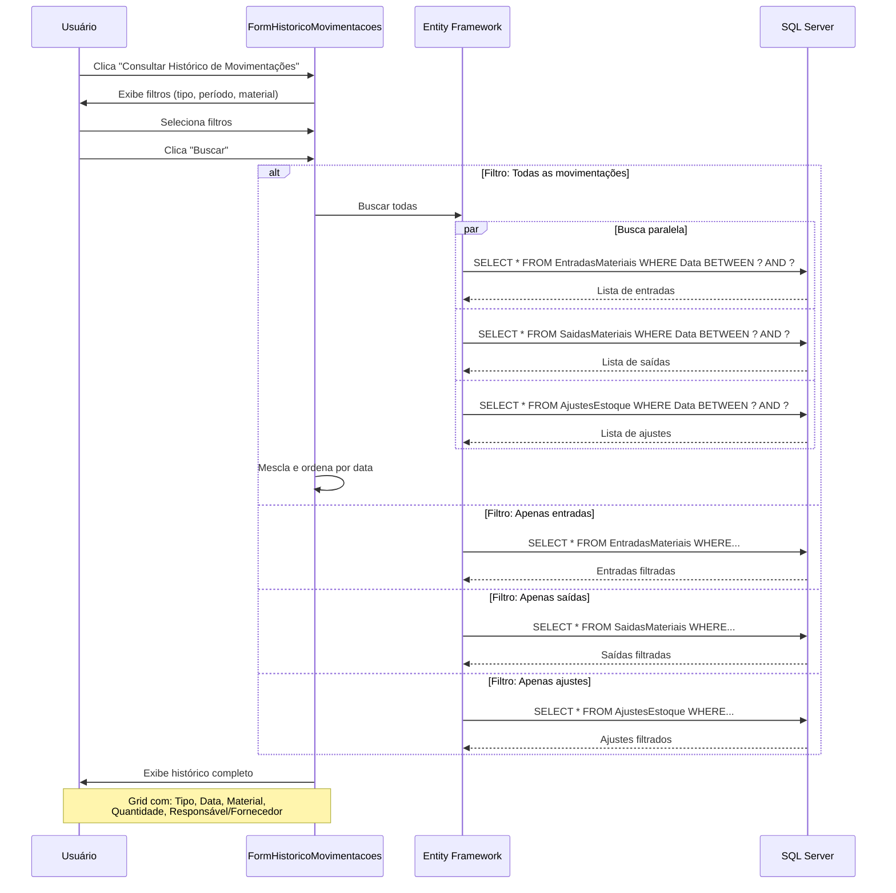
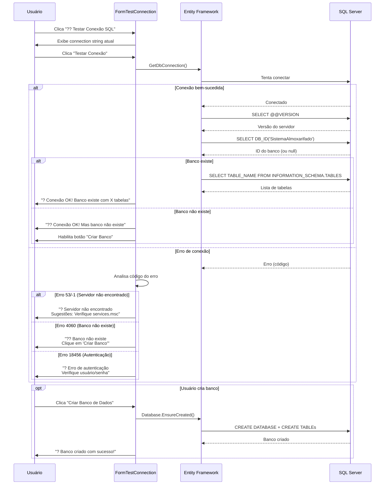
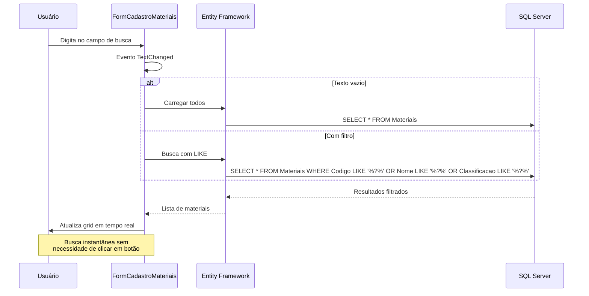

# Diagramas de Fluxo - Sistema de Almoxarifado

## Fluxo de Inicialização do Sistema

Este fluxo demonstra como o sistema inicializa e configura o banco de dados automaticamente ao ser executado pela primeira vez. O processo verifica se o banco existe, cria a estrutura necessária e oferece a opção de popular com dados de exemplo para facilitar os testes iniciais.



---

## Fluxo de Cadastro de Material

Este fluxo ilustra o processo completo de cadastramento de um novo material no sistema. Inclui validação de dados, verificação de duplicidade de código e atualização automática da listagem após o cadastro bem-sucedido.



---

## Fluxo de Entrada de Material

Este fluxo mostra como é registrada a entrada de materiais no estoque, incluindo informações sobre fornecedor, lote e validade. O sistema atualiza automaticamente o estoque disponível através de uma transação que garante a integridade dos dados.



---

## Fluxo de Saída de Material

Este fluxo detalha o processo de retirada de materiais do estoque, com validação de quantidade disponível. O sistema verifica se há estoque suficiente, registra a movimentação e emite alertas caso o estoque fique abaixo do mínimo estabelecido.



---

## Fluxo de Ajuste de Estoque

Este fluxo apresenta o processo de ajuste manual de estoque, geralmente utilizado para correções de inventário. Exige justificativa obrigatória para manter a rastreabilidade e auditoria das alterações realizadas no sistema.



---

## Fluxo de Relatório de Ponto de Pedido

Este fluxo demonstra como o sistema identifica e exibe materiais que estão com estoque abaixo do mínimo estabelecido. Permite aos gestores visualizar rapidamente quais itens precisam ser repostos, priorizando por classificação e urgência.



---

## Fluxo de Histórico de Movimentações

Este fluxo mostra como o sistema permite consultar todas as movimentações (entradas, saídas e ajustes) com diversos filtros. As consultas podem ser realizadas por tipo de movimentação, período específico ou material, facilitando auditorias e análises.



---

## Fluxo de Teste de Conexão SQL

Este fluxo apresenta a ferramenta de diagnóstico que permite verificar a conectividade com o SQL Server. O sistema testa a conexão, identifica problemas comuns e oferece soluções, além de permitir a criação do banco de dados diretamente pela interface.



---

## Fluxo de Busca e Filtro

Este fluxo demonstra a funcionalidade de busca em tempo real disponível nas telas de listagem. O sistema filtra automaticamente os registros à medida que o usuário digita, sem necessidade de clicar em botões, proporcionando uma experiência ágil e intuitiva.



---

## Diagrama de Relacionamento de Entidades

```mermaid
erDiagram
    MATERIAIS ||--o{ ENTRADAS : "tem"
    MATERIAIS ||--o{ SAIDAS : "tem"
    MATERIAIS ||--o{ AJUSTES : "tem"
    
    MATERIAIS {
        int Id PK
        string Codigo UK
        string Nome
        string UnidadeMedida
        string Classificacao
        int EstoqueMinimo
        int EstoqueAtual
        datetime DataCadastro
    }
    
    ENTRADAS {
        int Id PK
        int MaterialId FK
        string Fornecedor
        int Quantidade
        decimal CustoUnitario
        string NumeroLote
        string DataValidade
        datetime DataEntrada
    }
    
    SAIDAS {
        int Id PK
        int MaterialId FK
        string SetorSolicitante
        string Responsavel
        int Quantidade
        datetime DataSaida
    }
    
    AJUSTES {
        int Id PK
        int MaterialId FK
        int QuantidadeAnterior
        int NovaQuantidade
        string Justificativa
        datetime DataAjuste
    }
